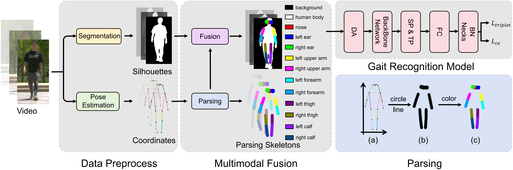

<div align="center">
<hr>
<font size="6"><i><b>PSGait: Gait Recognition using Parsing Skeleton</b></i></font>
<br><br>
<a href='https://arxiv.org/pdf/2503.12047'></a>
&nbsp;
<br><br>
<i>Hangrui Xu, Zhengxian Wu, Chuanrui Zhang, Zhuohong Chen, Zhifang Liu, Peng Jiao, Haoqian Wang*</i>
</div>




## 🔥 Highlights

- 🧠 **Novel Representation**: Introduces *Parsing Skeleton* to capture fine-grained human dynamics  
- 🎯 **Higher Information Entropy** than traditional silhouettes or skeletons  
- ⚡ **Plug-and-Play**: Compatible with existing gait recognition frameworks (e.g., OpenGait)  
- 🚀 **Performance Gain**: Up to **+15.7% Rank-1 accuracy** improvement  
- 🪶 **Lightweight & Efficient**: Better performance with reduced computational cost  

---

## 📰 News
- 🔥 (2026.02) Paper is available on arXiv: [PSGait: Gait Recognition using Parsing Skeleton](https://arxiv.org/pdf/2503.12047)
- 🎉 (2026.01) This paper has been accepted to **ICASSP 2026**.

---

## 👀 Abstract
Gait recognition has emerged as a robust biometric modality due to its non-intrusive nature. Conventional gait recognition methods mainly rely on silhouettes or skeletons. While effective in controlled laboratory settings, their limited information entropy restricts generalization to real-world scenarios. To overcome this, we propose a novel representation called Parsing Skeleton, which uses a skeleton-guided human parsing method to capture fine-grained body dynamics with much higher information entropy. To effectively explore the capability of the Parsing Skeleton, we also introduce PSGait, a framework that fuses Parsing Skeleton with silhouettes to enhance individual differentiation. Comprehensive benchmarks demonstrate that PSGait outperforms state-of-the-art multimodal methods while significantly reducing computational resources. As a plug-and-play method, it achieves an improvement of up to 15.7% in the accuracy of Rank-1 in various models. These results validate the Parsing Skeleton as a lightweight, effective, and highly generalizable representation for gait recognition in the wild.

---

## ⚙️ Environment Setup

### Install Environment via Anaconda (Recommended)
```bash
conda create -n psgait python=3.9.0
conda activate psgait
pip install -r requirements.txt
```

---

## 🧩 Skeleton Generation (Optional)

For dataset samples without provided skeletons, we use [**SAPIENS**](https://github.com/facebookresearch/sapiens) to generate the corresponding skeletons from the images.

---

## 📦 Data Preparation Pipeline
### Step 1: Generate Parsing Skeleton Images
You need to modify the skeleton path, silhouette path, output path, and log path to your desired locations.
```bash
parsing.sh
```
### Step 2: Generate Aligned Images
Modify the skeleton path, silhouette path, output path, and log path to your desired locations.
```bash
transform.sh
```
### Step 3: Convert Images to .pkl Files

The silhouette path here should point to the **aligned images**.

```bash
pkl_process.sh
```

## 🏃 Training
You can use the aligned pkl files to train various gait recognition networks.

```bash
CUDA_VISIBLE_DEVICES=0,1 python -m torch.distributed.launch --nproc_per_node=2 opengait/main.py --cfgs ./configs/baseline/baseline.yaml --phase train
```


## 📜 License

This repository is released under the Apache 2.0 license.


## 😉 Citation
Please consider citing our paper if our code are useful:
```bib
@article{xu2025psgait,
      title={PSGait: Gait Recognition using Parsing Skeleton}, 
      author={Hangrui Xu and Zhengxian Wu and Chuanrui Zhang and Zhuohong Chen and Zhifang Liu and Peng Jiao and Haoqian Wang},
      journal={arXiv preprint arXiv:2503.12047},
      year={2025}
}
```


## 🙏 Acknowledgements
- The codebase is based on [OpenGait](https://github.com/ShiqiYu/OpenGait)